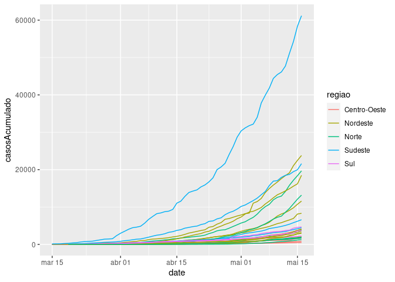

<!-- README.md is generated from README.Rmd. Please edit that file -->

# datacovidbr

<!-- badges: start -->

[](https://travis-ci.org/Freguglia/datacovidbr)
<!-- badges: end -->

O `datacovidbr` é um pacote em R com o objetivo de facilitar a
importação e leitura dos dados da COVID-19 de fontes brasileiras e
mundiais, automatizando os mecanismos de análise desses dados em R. No
momento os dados disponíveis são os do Ministério da Saúde
(<https://covid.saude.gov.br/>) para dados brasileiros por estados e
regiões, os do repositório [Brasil.io](https://brasil.io/home) para
dados brasileiros por município e os do repositório
[CSSEGISandData/COVID-19](https://github.com/CSSEGISandData/COVID-19)
mantido pela Johns Hopkins University Center for Systems Science and
Engineering (JHU CSSE).

As funções importam os dados atualizados diretamente, assim você não
precisa baixar os arquivos todos os dias e ler do seu próprio computador
ou ter o trabalho de automatizar isso :) Também é feito algum
pré-processamento para que a estrutura dos dados da `CSSEGISandData`
fique mais parecida com a do Ministério da Saúde.

## Instalação

Pela alta demanda no momento no CRAN, que gera muita demora no processo
de aceitação de novos pacotes e atualizações, o `datacovidbr` será
mantido apenas no Github. Para instalação de pacotes disponíveis no
Github, basta utilizar a função abaixo:

``` r
# install.packages("devtools")
devtools::install_github("Freguglia/datacovidbr")
```

## Exemplo

Os dados podem ser carregados com as funções `brMinisterioSaude()`,
`brasilio()` e `CSSEGISandData()`:

``` r
library(datacovidbr)
# Dados do Ministério da Saúde
est <- brMinisterioSaude()
est
#> # A tibble: 1,728 x 7
#>    regiao estado data       casosNovos casosAcumulados obitosNovos
#>    <chr>  <chr>  <date>          <int>           <int>       <int>
#>  1 Norte  RO     2020-01-30          0               0           0
#>  2 Norte  RO     2020-01-31          0               0           0
#>  3 Norte  RO     2020-02-01          0               0           0
#>  4 Norte  RO     2020-02-02          0               0           0
#>  5 Norte  RO     2020-02-03          0               0           0
#>  6 Norte  RO     2020-02-04          0               0           0
#>  7 Norte  RO     2020-02-05          0               0           0
#>  8 Norte  RO     2020-02-06          0               0           0
#>  9 Norte  RO     2020-02-07          0               0           0
#> 10 Norte  RO     2020-02-08          0               0           0
#> # … with 1,718 more rows, and 1 more variable: obitosAcumulados <int>

# Dados do Brasil.io
mun <- brasilio()
mun
#> # A tibble: 5,155 x 11
#>    date       state city  place_type confirmed deaths is_last estimated_popul…
#>    <date>     <chr> <chr> <chr>          <int>  <int> <lgl>              <int>
#>  1 2020-04-03 AC    "Acr… city               9      0 TRUE               15256
#>  2 2020-04-03 AC    "Por… city               1      0 TRUE               18504
#>  3 2020-04-03 AC    "Rio… city              36      0 TRUE              407319
#>  4 2020-04-03 AC    ""    state             46      0 TRUE              881935
#>  5 2020-04-03 AL    "Imp… city               4      0 TRUE                  NA
#>  6 2020-04-03 AL    "Mac… city              17      2 TRUE             1018948
#>  7 2020-04-03 AL    "Mar… city               1      0 TRUE               51901
#>  8 2020-04-03 AL    "Por… city               1      0 TRUE               20066
#>  9 2020-04-03 AL    ""    state             23      2 TRUE             3337357
#> 10 2020-04-03 AM    "Ano… city               1      0 TRUE               21010
#> # … with 5,145 more rows, and 3 more variables: city_ibge_code <int>,
#> #   confirmed_per_100k_inhabitants <dbl>, death_rate <dbl>

#Dados da CSSEGISandData
wor <- CSSEGISandData()
wor
#> # A tibble: 13,213 x 7
#> # Groups:   Country.Region [181]
#>    Country.Region data         Lat  Long casosAcumulados obitosAcumulado
#>    <chr>          <date>     <dbl> <dbl>           <int>           <int>
#>  1 Afghanistan    2020-01-22    33    65               0               0
#>  2 Afghanistan    2020-01-23    33    65               0               0
#>  3 Afghanistan    2020-01-24    33    65               0               0
#>  4 Afghanistan    2020-01-25    33    65               0               0
#>  5 Afghanistan    2020-01-26    33    65               0               0
#>  6 Afghanistan    2020-01-27    33    65               0               0
#>  7 Afghanistan    2020-01-28    33    65               0               0
#>  8 Afghanistan    2020-01-29    33    65               0               0
#>  9 Afghanistan    2020-01-30    33    65               0               0
#> 10 Afghanistan    2020-01-31    33    65               0               0
#> # … with 13,203 more rows, and 1 more variable: recuperadosAcumulado <int>
```

Os `data.frames` já vem em um formato que pode ser utilizado com todas
as outras ferramentas disponíveis em R, por exemplo, o `ggplot2`.

``` r
library(ggplot2)
ggplot(est, aes(x = data, y = casosNovos, group = estado, color = regiao)) +
  geom_line() +
  scale_x_date(limits = c(as.Date("2020-03-15"),NA)) 
```



## Contribuições e Dúvidas

Caso queira contribuir de alguma forma, pode enviar um Pull Request ou
abrir uma Issue caso tenha dúvidas. Contribuições podem ser em forma de

  - Sugestões em geral
  - Melhorias no pré-processamento
  - Inclusão de novas fontes para importar dados
  - Reportar problemas encontrados
